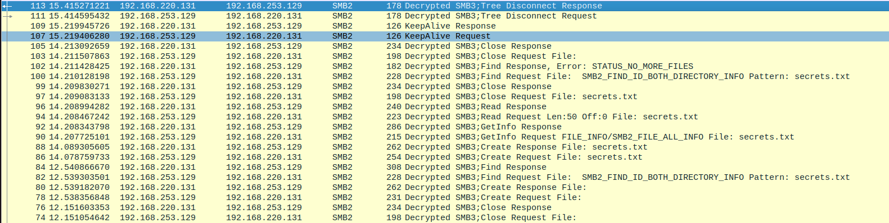

Python project to automate the creation and subsequent cracking of NTLMv2 hashes from an SMBv3 session. Full code can be found on
[github]https://github.com/Denrogh/SMB3NTLMCrack.

Basic program procedure is 

    1. Open pcap file and extract needed fields
    2. Get password hash and load into hashcat to crack
    3. Exit out if hash not found in reasonable time, if hash found - generate secret key
    4. Return secret key and instructions on how to decrypt within Wireshark.

The cracking of the hash allows for generation of the secret key used in communication between the two parties and the decryption of any captured session.
Some code can be seen below

```python
    def extract_packets(pcap):
        #Create a filter to only collect the important smb3 packets for calculating the Random Session Key
        capture = pyshark.FileCapture(pcap, display_filter="ntlmssp.messagetype == 2")
        for packet in capture:
            #print(packet.smb2.ntlmssp_ntlmserverchallenge)
            ntlm_challenge = packet.smb2.ntlmssp_ntlmserverchallenge.replace(':', '')
        # Close the capture
        capture.close()
    capture = pyshark.FileCapture(pcap, display_filter="ntlmssp.messagetype == 3")
    for packet in capture:
	#Issues with endianess make this code more complex than need be
    ba = bytearray.fromhex(packet.smb2.sesid.raw_value)
    print("Session ID = " + (''.join(format(x, '02x') for x in ba)))
    #Extracting necessary fields for NTLM hash.
    username = packet.smb2.ntlmssp_auth_username.replace(':', '')
    domain = packet.smb2.ntlmssp_auth_domain.replace(':', '')
    sesskey = packet.smb2.ntlmssp_auth_sesskey.replace(':', '')
    ntProofStr = packet.smb2.ntlmssp_ntlmv2_response_ntproofstr.replace(':', '')
    ntlmv2response = packet.smb2.ntlmssp_ntlmv2_response.replace(':', '')
    # Close the capture
    capture.close()
    smb3session = SMB3Session(domain, username, sesskey, ntlm_challenge, ntProofStr, ntlmv2response)
    return smb3session
```

After packet extract and key generation, we grab the secret key and can input it into Wireshark, giving us the decrypted SMB session allowing for full view of the exchange alongside any files retrived.



